# Sarana dan Prasarana Pembelajaran

## Fasilitas Pustaka {.unnumbered}

Fasilitas yang dimiliki meliputi buku teks, *e-books*, karya ilmiah, prosiding, dan jurnal dengan total lebih dari 100 eksemplar. Selain fasilitas putaka di level departemen, juga terdapat Perpustakaan Fakultas Teknik di level fakultas yang memberikan layanan khas berbentuk kegiatan, konsultasi, diskusi dan semacamnya untuk mendukung kemampuan mahasiswa mengikuti kegiatan akademik selama perkuliahan. Beberapa kegiatan rutin yang dilaksanakan adalah:

1.  Pelatihan manajemen dokumen ilmiah menggunakan *Zotero* dan *Mendeley*

2.  Pelatihan menulis dengan *LyX*

3.  Pelatihan membuat presentasi dengan *Prezi*

4.  Diskusi bersama pakar dalam berbagai tema, yaitu: plagiat, jurnal internasional, beasiswa

5.  Bekerjasama dengan **ECC (Engineering Career Center) UGM** untuk menyelenggarakan berbagai pelatihan *softskill*

Selain itu, juga terdapat fasilitas pendukung untuk kepustakaan dan penulisan jurnal yang sangat relevan dengan kebutuhan mahasiswa PMPSTI antara lain

1.  Fasilitas artikel ilmiah untuk artikel internasional elektronik seperti IEEE, Elsevier dan Springer

2.  Software pengecekan plagiarism (Turnitin)

3.  Software pengecekan grammar (Grammarly)

4.  Buku dan referensi ilmiah di perpustakaan fakultas Tekni

## Fasilitas High Performance Computing (AI Server) {.unnumbered}

Departemen Teknik Elektro dan Teknologi Informasi (DTETI) memiliki fasilitas High Performance Computing (HPC) berupa AI Server yang dilengkapi dengan GPU NVIDIA A100 Tensor Core. AI Server ini dirancang untuk mendukung penelitian dan pengembangan di bidang kecerdasan buatan, pembelajaran mesin, dan komputasi performa tinggi. Dengan kemampuan komputasi yang kuat, AI Server memungkinkan peneliti dan mahasiswa untuk melakukan eksperimen yang kompleks, pelatihan model besar, dan analisis data yang intensif secara efisien. Fasilitas ini merupakan bagian dari upaya DTETI untuk menyediakan infrastruktur teknologi yang mutakhir guna mendukung inovasi dan penelitian di era digital.

:::: responsive-center
::: lab-card
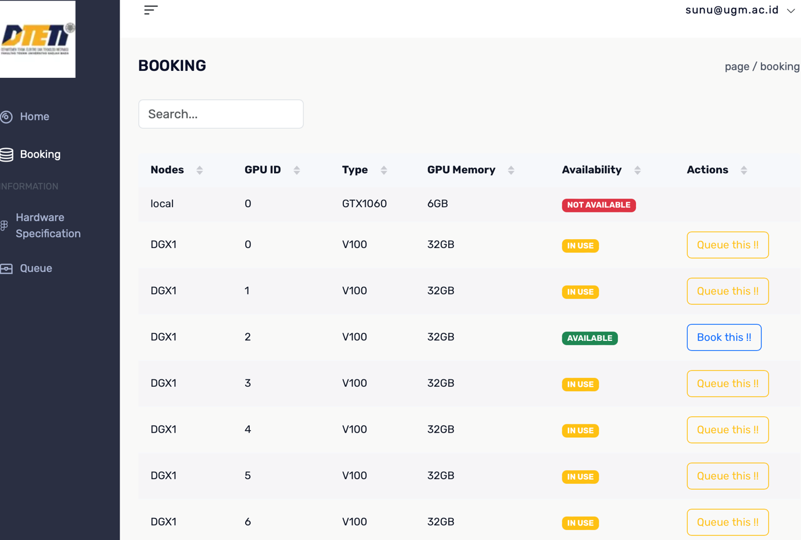   AI Server
:::
::::

## Peralatan Laboratorium {.unnumbered}

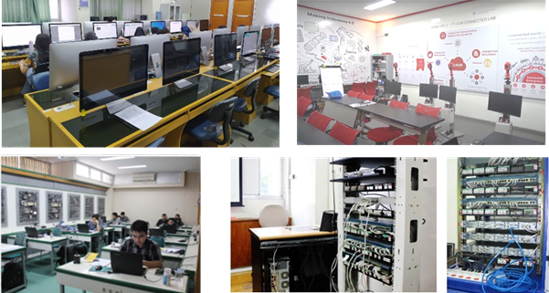{#fig-facilities fig-align="center"}

Untuk penunjang pembelajaran, penelitian dan pengabdian kepada masyarakat, terdapat 13 laboratorium di departemen dengan peralatan dan teknologi yang mutakhir yaitu Lab. Elektronika Dasar, Lab. Listrik Dasar, Lab. Instalasi, Lab. Teknik Tegangan Tinggi, Lab. Sistem Elektronis, Lab. Sistem Digital, Lab. Telekomunikasi dan Sistem Frekuensi, Lab. Instrumentasi dan Kendali, Lab. Elektronika Lanjut, Lab. Informatika dan Komputer, Lab. Jaringan Komputer dan Aplikasi Terdistribusi, Lab. Teknik Tenaga Listrik, serta Lab. Transmisi dan Distribusi. Selain itu, juga terdapat 6 laboratorium kerjasama dengan industri, yaitu Lab. Cisco Networking Academy, Lab. Microsoft Innovation Center, Lab. Schneider, UGM-Honeywell Connected Laboratory, Lab. Rolls-Royce, I-Green Laboratory Infineon UGM, serta 1 buah laboratorium khusus Aritificial Inteliigence bernama UGM AI Center.

## Kecukupan dan Aksesibilitas Prasarana {.unnumbered}

Selain memiliki sarana yang memadai, departemen juga dilengkapi dengan prasarana penunjang yang memadai. DTETI memiliki gedung 3 lantai yang dilengkapi dengan ruang perkuliahan, perpustakaan, serta co-working space yang ditata sesuai dengan tuntutan perkembangan zaman serta dilengkapi dengan teknologi informasi, akses internet berbasis wifi, dan sarana multimedia yang memadai. Selain itu, pembangunan gedung Smart Green Learning Centre (SGLC) dan Education Research and Inovation Centre (ERIC) di lingkungan fakultas juga diharapkan mampu menunjang kegiatan akademik mahasiswa, khususnya mahasiswa PMPSTI.

## Laboratorium Riset {.unnumbered}

### Basic Electrical, Biomedical, and Information Engineering Laboratory {.unnumbered}

Laboratorium ini memiliki peralatan untuk mendukung penelitian di bidang teknik elektro, biomedis, dan informatika. Peralatan yang tersedia meliputi osiloskop, multimeter, sumber tegangan, serta perangkat lunak simulasi seperti MATLAB dan LabVIEW. Ada 3 jenis basic lab:

::::::: columns
:::: {.column .responsive-col}
::: lab-card
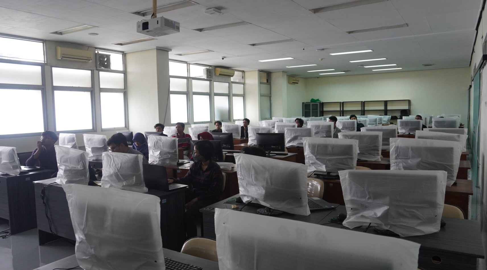   Basic Facilities 1
:::
::::

:::: {.column .responsive-col}
::: lab-card
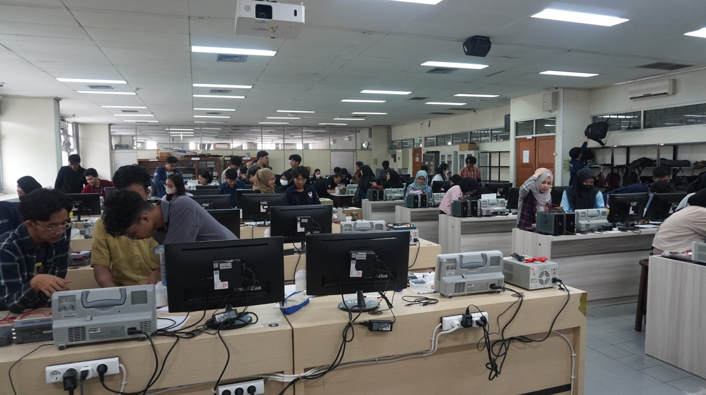   Basic Facilities 2
:::
::::
:::::::

:::: responsive-center
::: lab-card
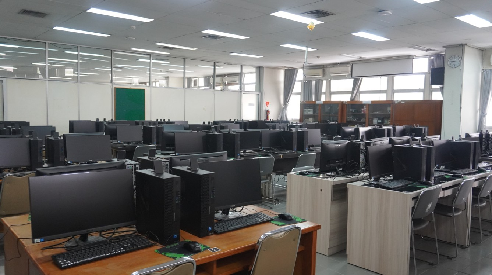   Basic Facilities 3
:::
::::

### High Voltage and Electrical Power Engineering Laboratory {.unnumbered}

Laboratorium ini dilengkapi dengan peralatan untuk penelitian di bidang teknik tegangan tinggi dan tenaga listrik. Peralatan yang tersedia meliputi transformator, generator, serta peralatan pengukuran untuk analisis sistem tenaga listrik.

::::::: columns
:::: {.column .responsive-col}
::: lab-card
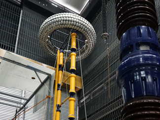
:::
::::

:::: {.column .responsive-col}
::: lab-card
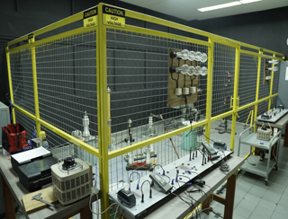
:::
::::
:::::::

::: {style="text-align: center; margin-top: 10px; font-size: 0.9em; color: #555; font-weight: 500;"}
High Voltage Engineering Lab Facilities
:::

::::::: columns
:::: {.column .responsive-col}
::: lab-card
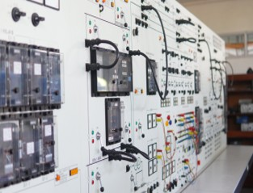
:::
::::

:::: {.column .responsive-col}
::: lab-card
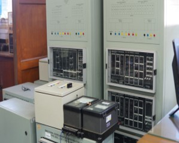
:::
::::
:::::::

::: {style="text-align: center; margin-top: 10px; font-size: 0.9em; color: #555; font-weight: 500;"}
Transmission and Distribution Lab Facilities
:::

::::::: columns
:::: {.column .responsive-col}
::: lab-card
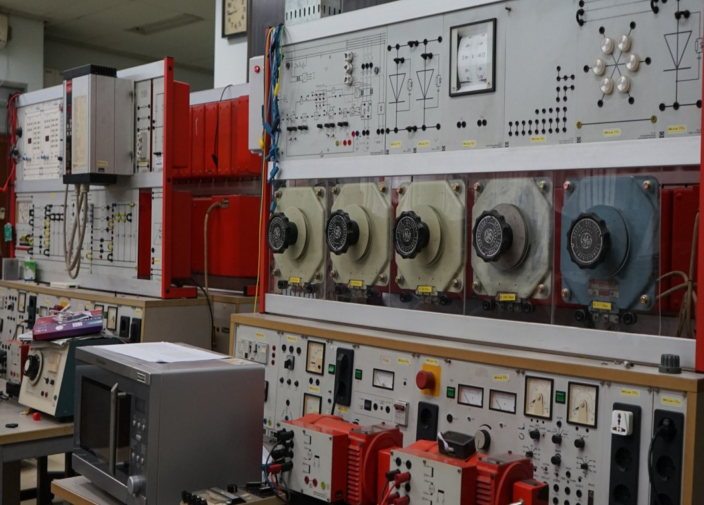
:::
::::

:::: {.column .responsive-col}
::: lab-card
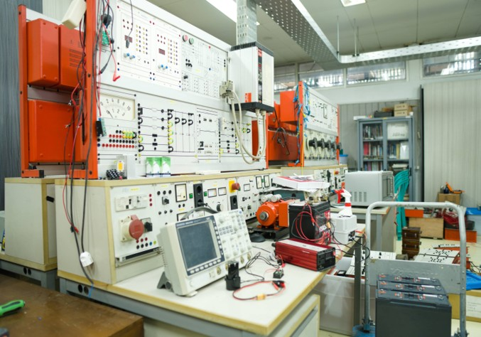
:::
::::
:::::::

::: {style="text-align: center; margin-top: 10px; font-size: 0.9em; color: #555; font-weight: 500;"}
Electric Power Engineering & Electrical Installation Lab Facilities 
:::

### Information, Computer Network, and Application Engineering Laboratory {.unnumbered}

Laboratorium ini memiliki peralatan untuk mendukung penelitian di bidang teknik informatika, jaringan komputer, dan aplikasi terdistribusi.

::::::: columns
:::: {.column .responsive-col}
::: lab-card
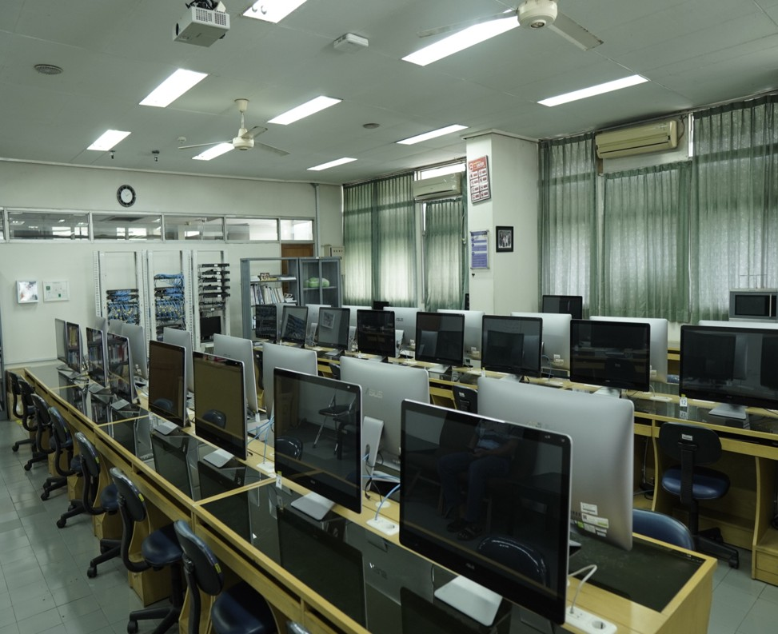
:::
::::

:::: {.column .responsive-col}
::: lab-card
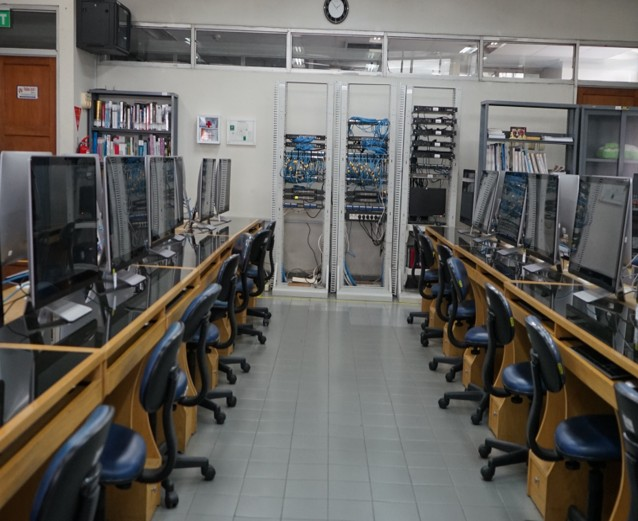
:::
::::
:::::::

::: {style="text-align: center; margin-top: 10px; font-size: 0.9em; color: #555; font-weight: 500;"}
Computer Networking and Distributed Applications Lab Facilities 
:::

### Signal, System, Control, and Biomedical Engineering Laboratory {.unnumbered}

Laboratorium ini dilengkapi dengan peralatan untuk penelitian di bidang teknik sinyal, sistem, kendali, dan biomedis.

::::::: columns
:::: {.column .responsive-col}
::: lab-card
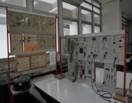
:::
::::

:::: {.column .responsive-col}
::: lab-card
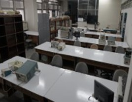
:::
::::
:::::::

::: {style="text-align: center; margin-top: 10px; font-size: 0.9em; color: #555; font-weight: 500;"}
Telecommunication and High Frequency System Lab Facilities
:::

::::::: columns
:::: {.column .responsive-col}
::: lab-card
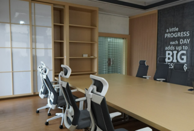
:::
::::

:::: {.column .responsive-col}
::: lab-card
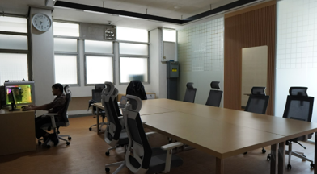
:::
::::
:::::::

::: {style="text-align: center; margin-top: 10px; font-size: 0.9em; color: #555; font-weight: 500;"}
IC Design Lab Facilities
:::