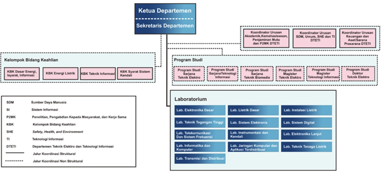

# Pengelolaan Program Studi

PMPSTI dikelola di level Departemen, bersamaan dengan lima program studi lain (Program Sarjana PS Teknik Elektro, Program Sarjana PS Teknologi Informasi, Program Sarjana PS Teknik Biomedis, Program Magister PS Teknik Elektro, dan Program Doktor PS Teknik Elektro). Pengelolaan di level departemen dipimpin oleh Ketua Departemen dan Sekretaris Departemen, dibantu koordinator urusan Akademik, Kemahasiswaan, Penjaminan Mutu, dan P2MK; koordinator urusan SDM, Umum, SHE, dan Teknologi Informasi; dan koordinator urusan Keuangan, dan Aset/Sarana Prasarana. Pengelolaan  yang ada pada level departemen memungkinkan optimalisasi sumber daya yang dimiliki, termasuk di dalamnya pembagian tugas mengajar, pemerataan beban bimbingan skripsi, Tesis, maupun disertasi, layanan administratif tenaga kependidikan, dan pemanfaatan sarana prasarana lain yang dimiliki oleh Departemen.

Setiap Program Studi, termasuk PMPSTI, memiliki satu orang Ketua Program Studi dan Sekretaris Program Studi. Ketua Program Studi dan Sekretaris Program Studi bertanggung jawab secara langsung dalam memastikan program yang telah disusun dapat berjalan dengan baik dan efektif. Struktur organisasi dan tata kelola di level Departemen ditunjukkan pada Gambar di bawah ini.

{#fig-org fig-align="center"}