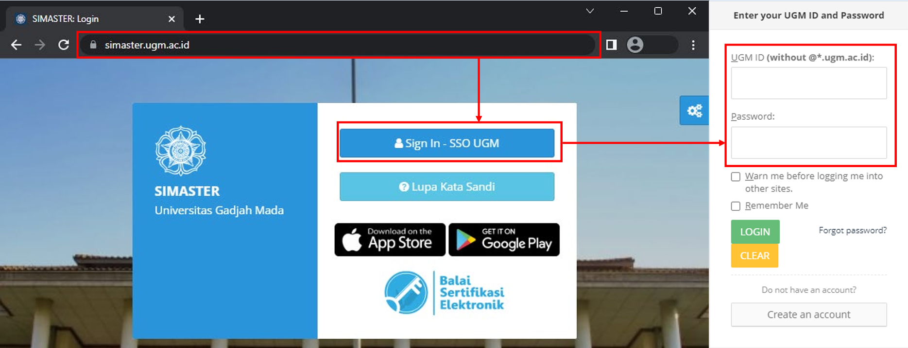
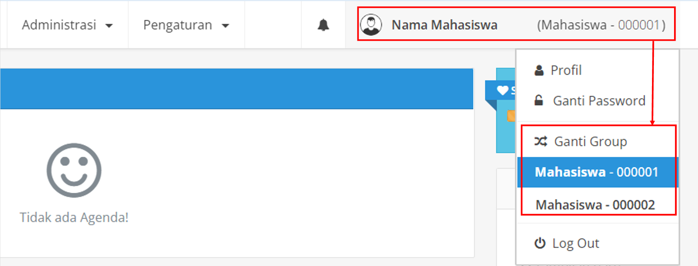
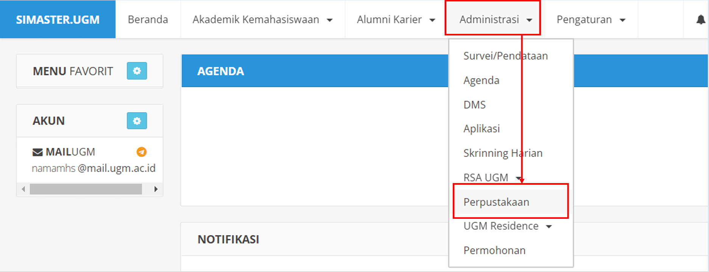
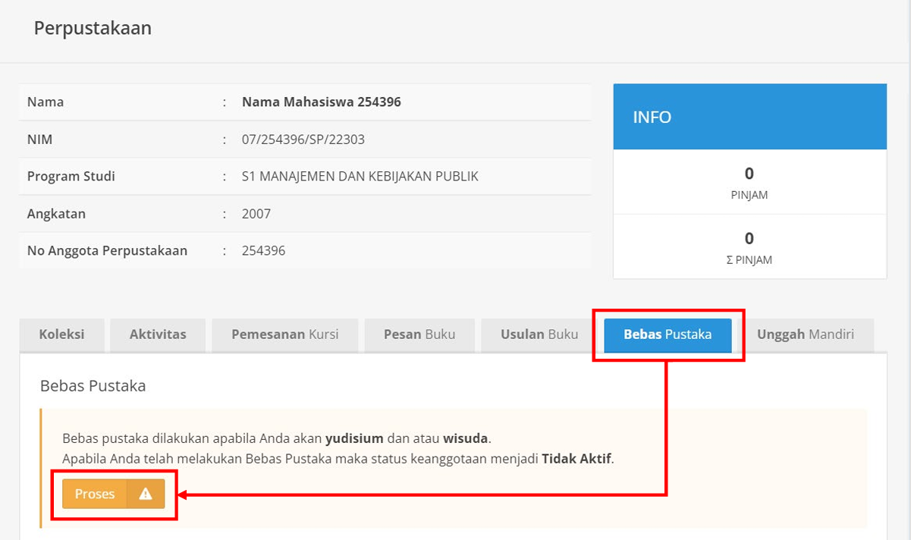
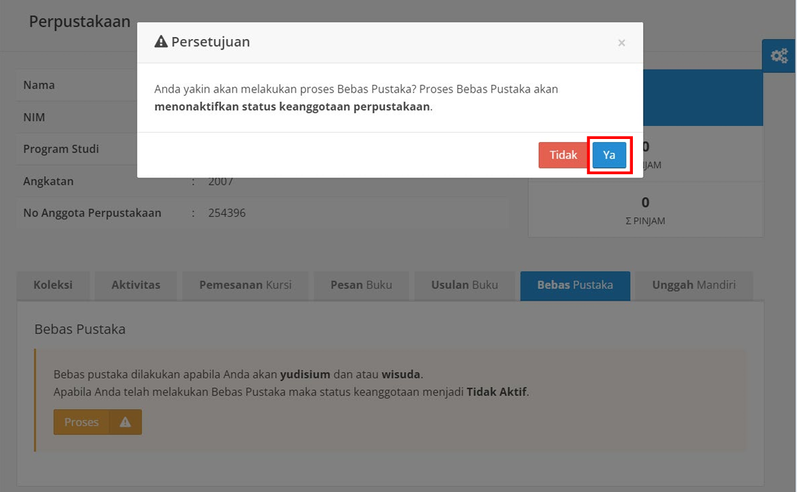
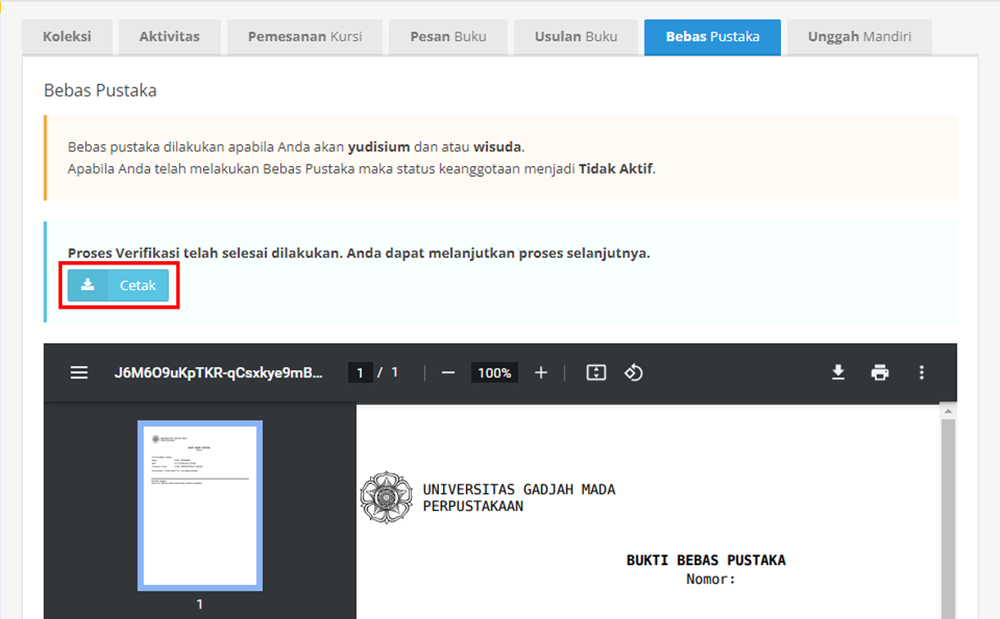
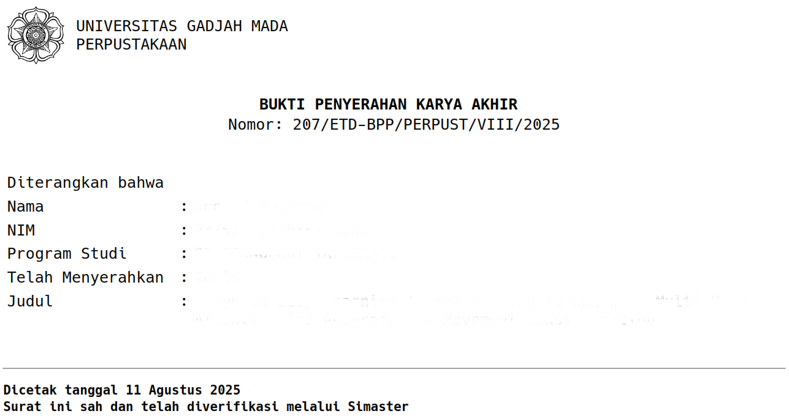

## Wisuda

::: callout-note
## Perhitungkan waktu kapan saudara/i ingin ikut wisuda:

-   Jika ingin mengikuti wisuda pada periode I, maka maksimal penyelesaian unggah mandiri ETD UGM dan pendaftaran akun melalui simaster di Prodi adalah pada tanggal 19 September.

-   Jika ingin mengikuti wisuda pada periode II, maka maksimal penyelesaian unggah mandiri ETD UGM dan pendaftaran akun melalui simaster di Prodi adalah pada tanggal 19 Desember.

-   Jika ingin mengikuti wisuda pada periode III, maka maksimal penyelesaian unggah mandiri ETD UGM dan pendaftaran akun melalui simaster di Prodi adalah pada tanggal 19 Maret.

-   Jika ingin mengikuti wisuda pada periode IV, maka maksimal penyelesaian unggah mandiri ETD UGM dan pendaftaran akun melalui simaster di Prodi adalah pada tanggal 19 Juni.

-   Pendaftaran akun melalui website simaster.

-   Untuk periode yang berhimpit dengan idul fitri akan disesuaikan kemudian Dimanakah Saudara/i dapat mengakses timeline kelengkapan syarat wisuda oleh Universitas? [Klik di sini](https://akademik.ugm.ac.id/category/wisuda/).
:::

::: callout-important
## NOTIFIKASI UNTUK WISUDA

**Setiap tanggal 19 Januari/April/Juli/Oktober paling lambat mendaftar**
:::

### Bebas Pustaka dan Unggah Mandiri di Simaster

```{dot}
//| fig-width: 14
//| fig-align: center

digraph SIMASTER {
    rankdir=TB;
    splines=true; // Mengembalikan ke jalur melengkung alami agar tidak berantakan
    nodesep=0.7; 
    ranksep=0.6;

    // FONT DIBESARKAN SESUAI PERMINTAAN
    graph [fontname="Helvetica" fontsize=16 pad=0.5];
    node  [fontname="Helvetica-Bold" fontsize=14 style="filled,rounded" shape=box margin="0.25,0.15" color="#1e3a5f" penwidth=1.5];
    
    // KEPALA PANAH DIPERKECIL (arrowsize=0.5)
    edge  [fontname="Helvetica-Bold" fontsize=12 arrowsize=0.5 penwidth=1.2 color="#1e3a5f"];

    // --- DEFINISI NODES ---
    Mulai     [label="MULAI" shape=oval fillcolor="#1d4ed8" fontcolor=white color="#1d4ed8"]
    Buka      [label="Buka\nsimaster.ugm.ac.id" fillcolor="#dbeafe"]
    Login     [label="Login\nSimaster" fillcolor="#dbeafe"]
    Jenjang   [label="Pilih sesuai\nJenjang Pendidikan" fillcolor="#dbeafe"]
    Menu      [label="Pilih Menu\nPerpustakaan" fillcolor="#dbeafe"]

    SubBebas  [label="Pilih SubMenu\nBebas Pustaka" fillcolor="#dbeafe"]
    DecBebas  [label="Bebas\nPustaka?" shape=diamond fillcolor="#fef9c3" fontcolor="#713f12" color="#ca8a04" margin="0.05,0.1"]
    Tanggung  [label="Menyelesaikan\ntanggungan" fillcolor="#fee2e2" fontcolor="#7f1d1d" color="#dc2626"]
    Cetak     [label="Cetak Bukti\nBebas Pustaka" fillcolor="#dbeafe"]
    DecProf   [label="Mahasiswa\nProfesi?" shape=diamond fillcolor="#fef9c3" fontcolor="#713f12" color="#ca8a04" margin="0.05,0.1"]

    SubUnggah [label="Pilih SubMenu\nUnggah Mandiri" fillcolor="#dbeafe"]
    IsiData   [label="Isi Data\nMahasiswa" fillcolor="#dbeafe"]
    IsiForm   [label="Isi Formulir Data\nKarya Akhir" fillcolor="#dbeafe"]
    Unggah    [label="Unggah File\nKarya Akhir" fillcolor="#dbeafe"]
    DecIzin   [label="Izin\nPublikasi?" shape=diamond fillcolor="#fef9c3" fontcolor="#713f12" color="#ca8a04" margin="0.05,0.1"]

    Surat     [label="Membuat Surat\nPernyataan" fillcolor="#fee2e2" fontcolor="#7f1d1d" color="#dc2626"]
    DecVerif  [label="Proses\nVerifikasi" shape=diamond fillcolor="#fef9c3" fontcolor="#713f12" color="#ca8a04" margin="0.05,0.1"]
    Perbaikan [label="Perbaikan\nData" fillcolor="#fee2e2" fontcolor="#7f1d1d" color="#dc2626"]

    Selesai   [label="SELESAI" shape=oval fillcolor="#1d4ed8" fontcolor=white color="#1d4ed8"]


    // --- 1. ALUR VERTIKAL AWAL (KIRI ATAS) ---
    Mulai -> Buka -> Login -> Jenjang -> Menu;


    // --- 2. BARIS UTAMA 1 (BEBAS PUSTAKA) ---
    { rank=same; Menu; SubBebas; DecBebas; Cetak; DecProf; Surat; Perbaikan; }
    Menu -> SubBebas -> DecBebas -> Cetak -> DecProf;


    // --- 3. FOKUS JALUR BEBAS PUSTAKA (LOOP TANGGUNGAN) ---
    // Ditata satu tingkat di atas baris utama agar melengkung rapi ke atas
    { rank=same; Jenjang; Tanggung; }
    DecBebas -> Tanggung [label="TIDAK" color="#dc2626" fontcolor="#dc2626"];
    Tanggung -> SubBebas [color="#dc2626"];


    // --- 4. BARIS UTAMA 2 (UNGGAH MANDIRI) ---
    { rank=same; SubUnggah; IsiData; IsiForm; Unggah; DecIzin; DecVerif; }
    DecProf -> SubUnggah [label="TIDAK"];
    SubUnggah -> IsiData -> IsiForm -> Unggah -> DecIzin -> DecVerif;


    // --- 5. ALUR IZIN & VERIFIKASI (JALUR MERAH) ---
    DecIzin -> Surat [label="TIDAK" color="#dc2626" fontcolor="#dc2626"];
    Surat -> DecVerif [color="#dc2626"];

    DecVerif -> Perbaikan [label="DITOLAK" color="#dc2626" fontcolor="#dc2626"];
    Perbaikan -> IsiData [color="#dc2626"];


    // --- 6. PENYELESAIAN (KANAN BAWAH) ---
    { rank=same; Selesai }
    DecProf -> Selesai [label="YA"];
    DecVerif -> Selesai [label="DISETUJUI"];
}
```

::: {.callout-note icon="true"}
## Ketentuan Umum

1.  Proses **Unggah Mandiri** baru dapat dilakukan **setelah** Anda menyelesaikan tahapan **Bebas Pustaka**.
2.  **Khusus Mahasiswa Profesi:** Hanya diwajibkan melakukan proses **Bebas Pustaka** dan **tidak disyaratkan** untuk melakukan Unggah Mandiri.
3.  Setelah proses Bebas Pustaka disetujui, status keanggotaan Perpustakaan Anda akan otomatis **dinonaktifkan**.
4.  Apabila sistem mendeteksi masih terdapat transaksi denda atau peminjaman buku, mohon segera menyelesaikannya di Perpustakaan setempat.
5.  Ketentuan persyaratan UNGGAH MANDIRI dapat dilihat pada link berikut: [ugm.id/skunggah](https://ugm.id/skunggah)
:::

### Bebas Pustaka

```{dot}
//| fig-width: 10
//| fig-align: center

digraph SIMASTER_BEBAS_PUSTAKA {
    rankdir=TB;
    splines=true; // Menggunakan curve alami agar alur loop tidak berantakan
    nodesep=0.7; 
    ranksep=0.6;

    // DESAIN FONT BESAR
    graph [fontname="Helvetica" fontsize=16 pad=0.5];
    node  [fontname="Helvetica-Bold" fontsize=14 style="filled,rounded" shape=box margin="0.25,0.15" color="#1e3a5f" penwidth=1.5];
    
    // DESAIN PANAH KECIL
    edge  [fontname="Helvetica-Bold" fontsize=12 arrowsize=0.5 penwidth=1.2 color="#1e3a5f"];

    // --- DEFINISI NODES ---
    Mulai     [label="MULAI" shape=oval fillcolor="#1d4ed8" fontcolor=white color="#1d4ed8"]
    Buka      [label="Buka\nsimaster.ugm.ac.id" fillcolor="#dbeafe"]
    Login     [label="Login\nSimaster" fillcolor="#dbeafe"]
    Jenjang   [label="Pilih sesuai\nJenjang Pendidikan" fillcolor="#dbeafe"]
    Menu      [label="Pilih Menu\nPerpustakaan" fillcolor="#dbeafe"]

    Tanggung  [label="Menyelesaikan\ntanggungan" fillcolor="#fee2e2" fontcolor="#7f1d1d" color="#dc2626"]
    SubBebas  [label="Pilih SubMenu\nBebas Pustaka" fillcolor="#dbeafe"]
    DecBebas  [label="Bebas\nPustaka?" shape=diamond fillcolor="#fef9c3" fontcolor="#713f12" color="#ca8a04" margin="0.05,0.1"]
    Cetak     [label="Cetak Bukti\nBebas Pustaka" fillcolor="#dbeafe"]
    
    Selesai   [label="SELESAI" shape=oval fillcolor="#1d4ed8" fontcolor=white color="#1d4ed8"]

    // --- 1. ALUR VERTIKAL UTAMA (KIRI) ---
    Mulai -> Buka -> Login -> Jenjang -> Menu;

    // --- 2. PENYELARASAN BARIS (RANK) ---
    // Mengunci posisi horizontal agar persis seperti gambar baru Anda
    { rank=same; Buka; Tanggung; }
    { rank=same; Login; SubBebas; DecBebas; Cetak; }
    { rank=same; Jenjang; Selesai; }

    // --- 3. ALUR JALUR KANAN DAN LOOP BEBAS PUSTAKA ---
    Menu -> SubBebas;
    SubBebas -> DecBebas;
    
    // Alur TIDAK (Naik ke atas ke kotak Tanggungan, lalu turun kembali)
    DecBebas -> Tanggung [label="TIDAK" color="#dc2626" fontcolor="#dc2626"];
    Tanggung -> SubBebas [color="#dc2626"];
    
    // Alur YA dan Selesai
    DecBebas -> Cetak [label="YA"];
    Cetak -> Selesai;
}
```

#### Proses Bebas Pustaka

::: panel-tabset
## Langkah 1: Login

Buka halaman SIMASTER dan masukkan akun Anda. {width="70%"}

## Langkah 2: Pilih Group

Pilih Group yang ada di menu kanan. {width="70%"}

## Langkah 3: Menu Perpustakaan

Klik menu “Administrasi” kemudian “Perpustakaan” {width="70%"}

## Langkah 4: Bebas Pustaka

Jika tidak memiliki tanggungan pinjaman atau denda dengan Perpustakaan, maka klik “Proses” {width="70%"}

## Langkah 5: Persetujuan

Pilih “Ya” pada pesan Persetujuan {width="70%"}

## Langkah 6: Cetak

Cetak “Bukti Bebas Pustaka” {width="70%"}
:::

### Unggah Mandiri

```{dot}
//| fig-width: 12
//| fig-align: center

digraph SIMASTER_UNGGAH_MANDIRI {
    rankdir=TB;
    splines=true; // Curve alami agar alur loop kembali tidak saling tabrakan
    nodesep=0.7; 
    ranksep=0.6;

    // FONT TETAP BESAR & TEGAS
    graph [fontname="Helvetica" fontsize=16 pad=0.5];
    node  [fontname="Helvetica-Bold" fontsize=14 style="filled,rounded" shape=box margin="0.25,0.15" color="#1e3a5f" penwidth=1.5];
    
    // UKURAN KEPALA PANAH DIPERKECIL (arrowsize=0.5)
    edge  [fontname="Helvetica-Bold" fontsize=12 arrowsize=0.5 penwidth=1.2 color="#1e3a5f"];

    // --- DEFINISI NODES ---
    Mulai     [label="MULAI" shape=oval fillcolor="#1d4ed8" fontcolor=white color="#1d4ed8"]
    Buka      [label="Buka\nsimaster.ugm.ac.id" fillcolor="#dbeafe"]
    Login     [label="Login\nSimaster" fillcolor="#dbeafe"]
    Jenjang   [label="Pilih sesuai\nJenjang Pendidikan" fillcolor="#dbeafe"]
    Menu      [label="Pilih Menu\nPerpustakaan" fillcolor="#dbeafe"]

    SubUnggah [label="Pilih SubMenu\nUnggah Mandiri" fillcolor="#dbeafe"]
    IsiData   [label="Isi Data\nMahasiswa" fillcolor="#dbeafe"]
    IsiForm   [label="Isi Formulir Data\nKarya Akhir" fillcolor="#dbeafe"]
    Unggah    [label="Unggah File\nKarya Akhir" fillcolor="#dbeafe"]
    DecIzin   [label="Izin\nPublikasi?" shape=diamond fillcolor="#fef9c3" fontcolor="#713f12" color="#ca8a04" margin="0.05,0.1"]

    Surat     [label="Membuat Surat\nPernyataan" fillcolor="#fee2e2" fontcolor="#7f1d1d" color="#dc2626"]
    DecVerif  [label="Proses\nVerifikasi" shape=diamond fillcolor="#fef9c3" fontcolor="#713f12" color="#ca8a04" margin="0.05,0.1"]
    Perbaikan [label="Perbaikan\nData" fillcolor="#fee2e2" fontcolor="#7f1d1d" color="#dc2626"]

    Selesai   [label="SELESAI" shape=oval fillcolor="#1d4ed8" fontcolor=white color="#1d4ed8"]


    // --- 1. ALUR VERTIKAL AWAL (KIRI ATAS) ---
    Mulai -> Buka -> Login -> Jenjang -> Menu;


    // --- 2. PENGELOMPOKAN BARIS (MENGUNCI TINGGI NODE) ---
    // Meletakkan Surat Pernyataan dan Perbaikan Data di baris atas agar persis seperti gambar
    { rank=same; Login; Surat; Perbaikan; }
    
    // Baris utama alur Unggah Mandiri bergerak horizontal ke kanan
    { rank=same; Menu; SubUnggah; IsiData; IsiForm; Unggah; DecIzin; DecVerif; }
    
    // Tombol selesai di paling bawah
    { rank=same; Selesai; }


    // --- 3. JALUR UTAMA UNGHAH MANDIRI ---
    Menu -> SubUnggah -> IsiData -> IsiForm -> Unggah -> DecIzin;
    DecIzin -> DecVerif [label="YA"];


    // --- 4. ALUR PERIKSA & JALUR REVISI (MERAH) ---
    // Jalur Surat Pernyataan (Naik ke Surat, lalu turun ke Verifikasi)
    DecIzin -> Surat [label="TIDAK" color="#dc2626" fontcolor="#dc2626"];
    Surat -> DecVerif [color="#dc2626"];

    // Jalur Verifikasi Ditolak (Naik ke Perbaikan, lalu memutar jauh kembali ke IsiData)
    DecVerif -> Perbaikan [label="DITOLAK" color="#dc2626" fontcolor="#dc2626"];
    Perbaikan -> IsiData [color="#dc2626"];


    // --- 5. PENYELESAIAN ---
    DecVerif -> Selesai [label="DISETUJUI"];
}
```

::: {.callout-note icon="true"}
## Ketentuan – Unggah Mandiri

a.  Karya akhir mahasiswa bersifat final dan dibuktikan dengan adanya surat atau lembar pengesahan yang ditandatangani atau dilegalisasi oleh pengelola Fakultas/Sekolah;
b.  Karya akhir mahasiswa disertai dengan lembar pernyataan bebas plagiasi bermeterai, dengan nilai sesuai ketentuan yang berlaku;
c.  Syarat bermeterai sebagaimana dimaksud pada poin b (ketentuan) di atas tidak berlaku bagi karya akhir yang berasal dari mahasiswa asing;
d.  Penamaan file karya akhir mahasiswa sesuai dengan ketentuan yang telah ditetapkan oleh Perpustakaan Universitas Gadjah Mada;
e.  File naskah lengkap karya akhir mahasiswa disertai bookmark atau sesuai dengan ketentuan atau panduan yang berlaku; dan
f.  Unggah karya akhir dilakukan sesuai batas waktu yang sudah ditentukan untuk setiap periode yudisium, yang diatur oleh Fakultas/Sekolah, atau setiap periode wisuda, yang akan diatur melalui edaran wisuda oleh Direktorat Pendidikan dan Pengajaran. Ketentuan persyaratan UNGGAH MANDIRI dapat dilihat pada link berikut: [ugm.id/skunggah](https://ugm.id/skunggah)
:::

### Ketentuan Unggah Foto untuk Proses Ijazah

Kebutuhan foto cukup hanya dengan mengirimkan soft file. Silakan bisa update di data akun [**magister.jteti.ugm.ac.id**](https://magister.jteti.ugm.ac.id/) dan juga diunggah melalui [**TAUTAN G-FORM BERIKUT**](https://docs.google.com/forms/d/e/1FAIpQLScBsjS1b7BhYdZtSlhTyBPk8p_lnZ7KUBzoFTaiLJdxdUdVLg/viewform)

::: panel-tabset
## Ukuran Foto

-   Foto berwarna background putih
-   Ukuran maksimal 2 MB dengan rasio 3:4 format .jpg

## Pakaian

-   Pria: Kemeja putih, dasi hitam, jas hitam (bukan jas almamater)
-   Wanita: Kemeja putih, blazer hitam (bukan jas almamater)
-   Bagi Wanita Berhijab: Mengenakan kemeja putih, jas hitam (bukan jas almamater), jilbab hitam dan dimasukkan dalam kemeja

## Posisi

-   Badan dan kepala tegak sejajar menghadap depan
-   Kedua daun telinga harus kelihatan bagi yang tidak berhijab
-   Tidak menggunakan kacamata, cadar, masker, dan penghalang wajah lainnya

## Kualitas Foto

-   Foto harus jelas/tajam dan tidak kabur
-   Bukan foto hasil scan/repro dari HP
:::

::: {.callout-note appearance="simple"}
**Contoh tampilan Foto yang valid:** 
:::

Berikut diinformasikan tahapan untuk kelengkapan pemberkasan Wisuda:

Permohonan account wisuda melalui sistem [magister.jteti.ugm.ac.id](https://magister.jteti.ugm.ac.id/) dilayani **paling lambat H-3** sebelum poin 1 pada informasi [Jadwal Wisuda Universitas Gadjah Mada](https://akademik.ugm.ac.id/category/wisuda/) (silakan cek jatuh pada tanggal berapa, lalu untuk **pendaftaran akun ditutup H-3 sebelumnya**).

Lengkapi persyaratannya sebagai berikut atau silakan cek langsung dalam sistemnya: 

1.  Sudah Yudisium
2.  Upload Scan FC ijazah S1 yang dilegalisir/aslinya juga diperbolehkan.
3.  Upload Scan print-out bukti unggah ETD melalui <https://simaster.ugm.ac.id/>. Flow chart pengisian dapat dilihat pada link berikut \<\<[klik di sini](https://drive.google.com/file/d/11wl0JGgn7hb172xvc_FyEK6dWqxdVftW/view?usp=drive_link)\>\>

::: {.callout-note appearance="simple"}
**Contoh tampilan bukti unggah ETD yang valid:** 
:::

4.  Upload Scan seluruh file TOEFL dan TPA
5.  Upload Scan bukti bebas UKT yang digunakan pada syarat pendadaran
6.  Upload file foto sesuai ketentuan SIMASTER UGM. 
7.  Upload Scan **KTM** **dan KTP** (dijadikan 1 file) asli

**Account wisuda** akan diaktifkan segera setelah periode wisuda periode sebelumnya dilaksanakan. Account Wisuda ini akan menjadi dasar Prodi untuk memproses dan mengawal pengisian data SIMASTER UGM mahasiswa. Tanpa Aktivasi “Account Wisuda” melalui magister.jteti.ugm.ac.id proses pengisian data melalui SIMASTER UGM tidak akan diproses oleh Prodi. Setelah mendaftar Account Wisuda silakan menunggu untuk nantinya akan diinvite ke dalam grup calon wisudawan oleh Pak Dulhadi melalui WA setelah pendaftaran akun ditutup. 

Setelah nanti diinvite Pak Dulhadi ke dalam grup WA, maka mahasiswa baru dapat melakukan pengisian data di SIMASTER. Cek “tetangga kanan kiri” ya, jangan pasif/diam saja jika belum diinvite. 

Jangan lupa untuk melengkapi isian data Gama co-brand dan biodata melalui sistem wisuda (simaster.ugm.ac.id).

### Beberapa Kesalahan dalam Unggah Mandiri

Unggah mandiri merupakan aplikasi yang ditujukan untuk memudahkan proses penyerahan karya tulis akhir (skripsi/tugas akhir, tesis, dan disertasi) UGM sebagai salah satu syarat untuk mengikuti wisuda. Unggah mandiri dapat dilakukan melalui unggah.etd.ugm.ac.id, dan sudah diwajibkan bagi mahasiswa S2 dan S3 per Mei 2015. Panduan unggah mandiri juga sudah disediakan.

Verifikasi akan diberikan paling cepat 1 hari setelah mahasiswa melakukan proses unggah mandiri melalui email mahasiswa yang bersangkutan atau bisa memeriksa langsung di website. Jika unggah diterima dan terverifikasi, maka mahasiswa dapat mencetak bukti langsung melalui web unggah mandiri. Jika ditolak, mahasiswa harus melakukan perbaikan bagian yang dikoreksi. Verifikasi akan memakan waktu kurang lebih 2 jam sesudah mahasiswa melakukan perbaikan.

Mahasiswa harus memperhatikan nama file sebelum diunggah, pastikan sesuai yang disyaratkan (bisa dilihat di panduan manual), agar tidak gagal ketika diunggah. Beberapa kesalahan yang dilakukan mahasiswa sehingga permohonan ditolak dan mahasiswa harus melakukan perbaikan, al.

1.  Lembar surat pernyataan penulis tidak ditandatangani
2.  Tidak ada *bookmark*
3.  Tidak menyertakan abstrak, kadang mahasiswa hanya menyertakan *abstract* saja.

Meminimalkan kesalahan artinya tidak membuang waktu. Dalam waktu bersamaan banyak yang melakukan unggah mandiri, sehingga permohonan bisa tidak secepat yang diharapkan mahasiswa. Apalagi jika status permohonan ditolak karena kesalahan yang dilakukan mahasiswa dalam melakukan unggah mandiri, berarti akan lebih menyita waktu.